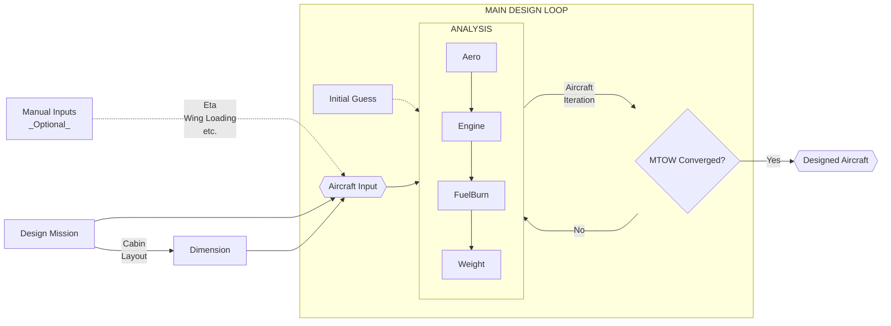
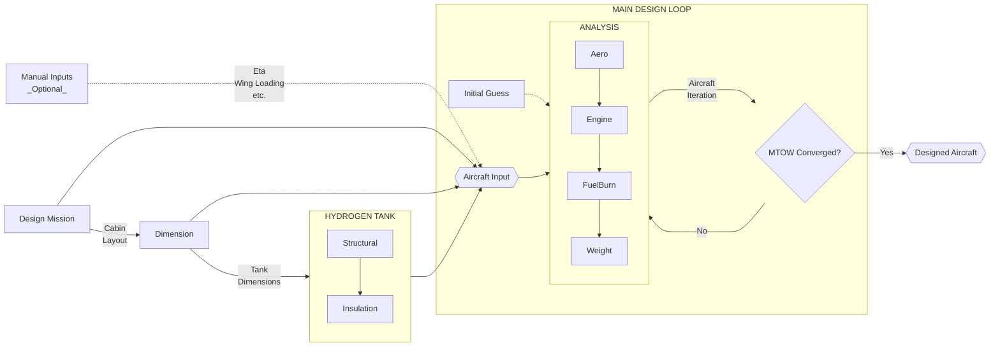
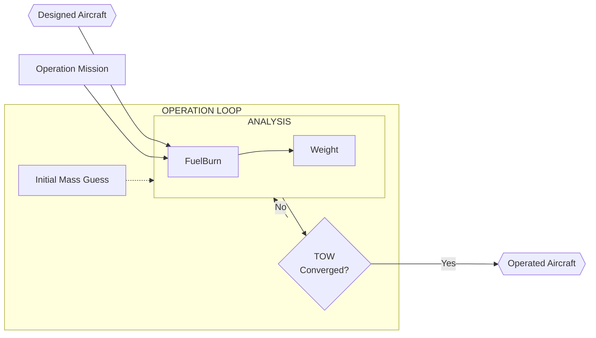
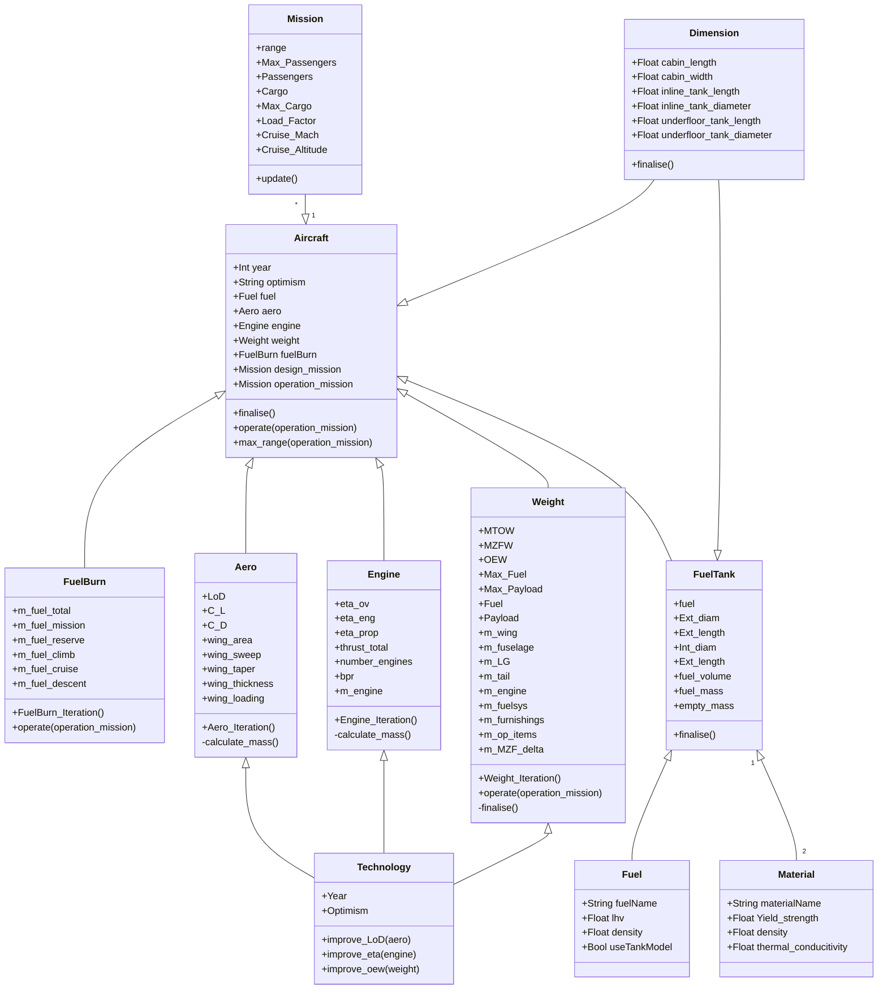

# AIA Aircraft Model

## General
Code is used to size aircraft based on mission requirements with calculations for:
1. Weight
2. Drag
3. Fuel Burn

Weight calculations are made using correlations and tank weight calculations are made using the AIA tank weight model.

## Flowchart

### Basic Design Loop

### Hydrogen Aircraft Design Flowchart

### Operation Loop

## Class Diagram

